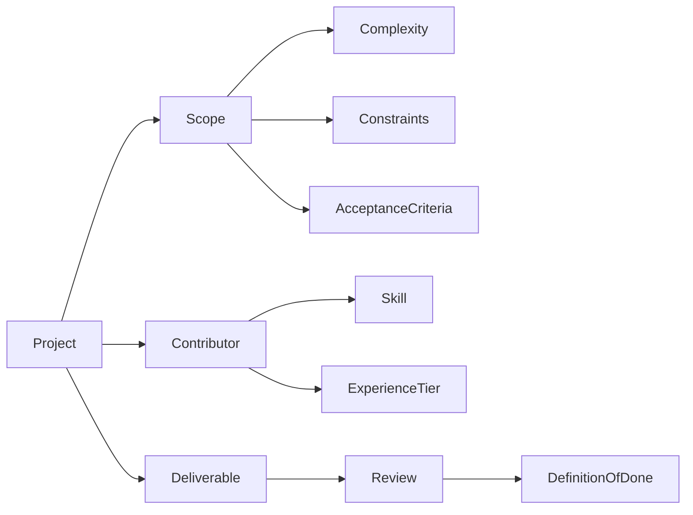

# Work Simplr Taxonomy v0.1

A structured classification framework for AI-enabled, project-based work.

---

## 1. Work Classification Layer

Defines the type and nature of work being executed.

### Work Type Categories
- Marketing
- Operations
- Product
- Research
- Technical
- Administrative

Purpose:
Provides routing logic for skills, templates, and review standards.

---

## 2. Scope Dimensions

Each project is evaluated across standardized dimensions:

- Estimated Hours (10–40 typical SprintWork™ range)
- Complexity Level (Low / Medium / High)
- Industry Context
- Deliverable Type
- Tool Stack Required
- Constraints
- Acceptance Criteria

These dimensions inform automation routing and pricing.

---

## 3. Skill Architecture

Contributors are categorized by:

- Skill Domain
- Proficiency Tier
- Tool Familiarity
- Experience Level

This enables:
- Intelligent matching
- Capacity planning
- Risk mitigation

---

## 4. Governance Layer

Defines execution safeguards:

- Definition of Done
- Review Requirements
- Escalation Criteria
- Human-in-Loop Thresholds
- Risk Flags

This ensures quality and marketplace trust.

---

## 5. Entity Relationships

---

## Design Principles

- Classification precedes automation
- Governance precedes scale
- Templates enable compounding learning
- Human oversight preserves trust

---

*This taxonomy supports scalable, AI-augmented execution without increasing operational headcount.*
